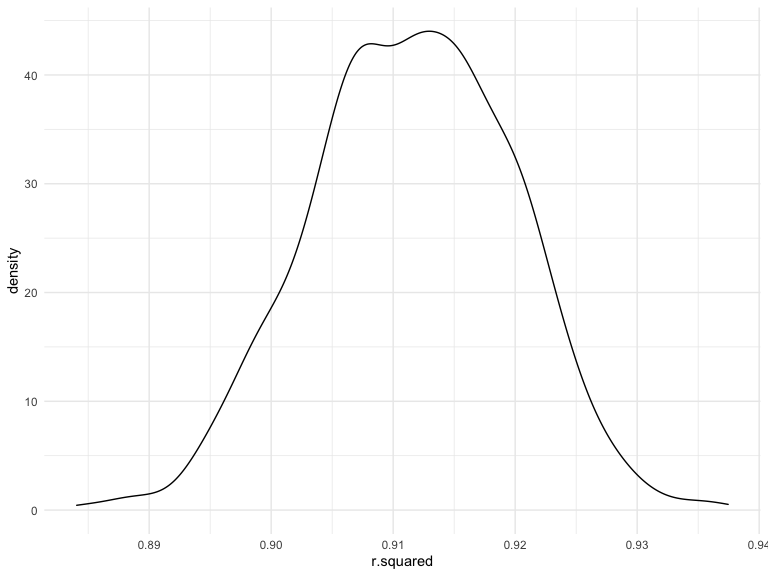
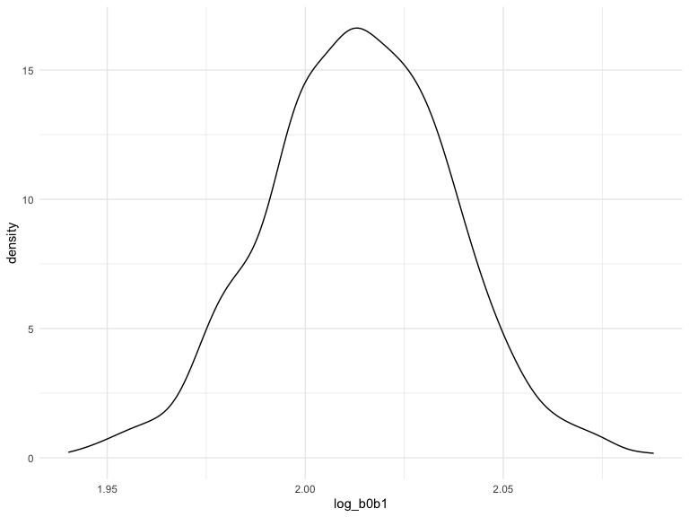
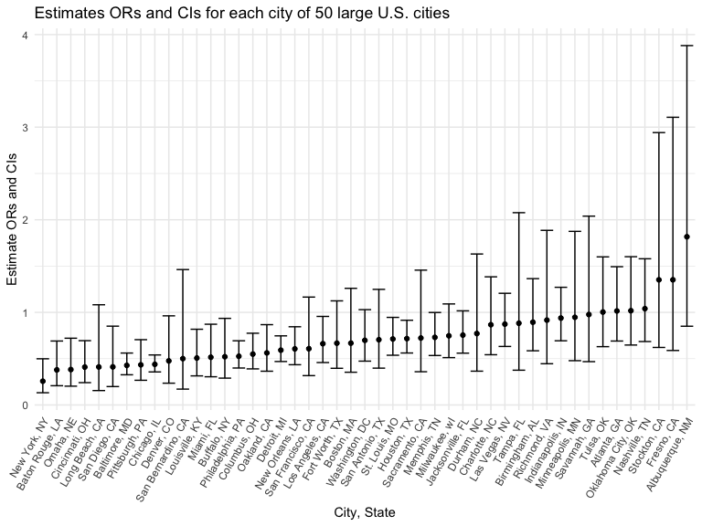
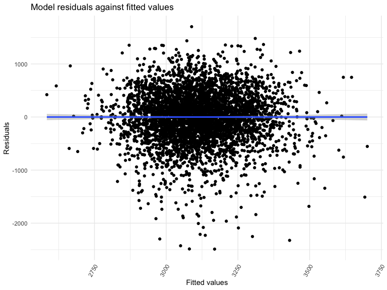

p8105_hw6_yz4436
================
Yuanhao Zhang
2022-12-02

### Problem 1

To obtain a distribution for $\hat{r}^2$, we’ll follow basically the
same procedure we used for regression coefficients: draw bootstrap
samples; the a model to each; extract the value I’m concerned with; and
summarize. Here, we’ll use `modelr::bootstrap` to draw the samples and
`broom::glance` to produce `r.squared` values.

``` r
weather_df = 
  rnoaa::meteo_pull_monitors(
    c("USW00094728"),
    var = c("PRCP", "TMIN", "TMAX"), 
    date_min = "2017-01-01",
    date_max = "2017-12-31") %>%
  mutate(
    name = recode(id, USW00094728 = "CentralPark_NY"),
    tmin = tmin / 10,
    tmax = tmax / 10) %>%
  select(name, id, everything())
```

    ## Registered S3 method overwritten by 'hoardr':
    ##   method           from
    ##   print.cache_info httr

    ## file min/max dates: 1869-01-01 / 2022-12-31

``` r
weather_df %>% 
  modelr::bootstrap(n = 1000) %>% 
  mutate(
    models = map(strap, ~lm(tmax ~ tmin, data = .x) ),
    results = map(models, broom::glance)) %>% 
  select(-strap, -models) %>% 
  unnest(results) %>% 
  ggplot(aes(x = r.squared)) + geom_density()
```



In this example, the $\hat{r}^2$ value is high, and the upper bound at 1
may be a cause for the generally skewed shape of the distribution. If we
wanted to construct a confidence interval for $R^2$, we could take the
2.5% and 97.5% quantiles of the estimates across bootstrap samples.
However, because the shape isn’t symmetric, using the mean +/- 1.96
times the standard error probably wouldn’t work well.

We can produce a distribution for $\log(\beta_0 * \beta1)$ using a
similar approach, with a bit more wrangling before we make our plot.

``` r
weather_df %>% 
  modelr::bootstrap(n = 1000) %>% 
  mutate(
    models = map(strap, ~lm(tmax ~ tmin, data = .x) ),
    results = map(models, broom::tidy)) %>% 
  select(-strap, -models) %>% 
  unnest(results) %>% 
  select(id = `.id`, term, estimate) %>% 
  pivot_wider(
    names_from = term, 
    values_from = estimate) %>% 
  rename(beta0 = `(Intercept)`, beta1 = tmin) %>% 
  mutate(log_b0b1 = log(beta0 * beta1)) %>% 
  ggplot(aes(x = log_b0b1)) + geom_density()
```



As with $r^2$, this distribution is somewhat skewed and has some
outliers.

The point of this is not to say you should always use the bootstrap –
it’s possible to establish “large sample” distributions for strange
parameters / values / summaries in a lot of cases, and those are great
to have. But it is helpful to know that there’s a way to do inference
even in tough cases.

## Problem 2

Import the raw dataset.

``` r
homicide_df = 
  read_csv("./data/homicide-data.csv", show_col_types = FALSE)
```

Create a city_state variable (e.g. “Baltimore, MD”), and a binary
variable indicating whether the homicide is solved. Omit cities Dallas,
TX; Phoenix, AZ; and Kansas City, MO, Tulsa, AL. Changing type of
victim_age to numeric and selecting victim_race that contains white and
black only.

``` r
homicide_df =
  homicide_df %>%
  janitor::clean_names() %>%
  mutate(
    city_state = str_c(city, ", ", state),
    be_solve = ifelse(disposition == "Closed by arrest", 1, 0)
  ) %>%
  filter(
    !city_state %in% c("Dallas, TX", "Phoenix, AZ", "Kansas City, MO", "Tulsa, AL"),
    victim_race %in% c("White", "Black")
  ) %>%
  mutate(
    victim_age = ifelse(victim_age == "Unknown", 1, as.numeric(victim_age)),
    victim_sex = ifelse(victim_sex == "Unknown", 1, victim_sex)
  ) %>%
  filter(
    victim_age != 1,
    victim_sex != 1)
```

Selecting the city of Baltimore, MD.

``` r
baltimore = 
  homicide_df %>%
  filter(city_state == "Baltimore, MD")
```

Use the glm function to fit a logistic regression with resolved vs
unresolved as the outcome and victim age, sex and race as predictors.
Save the output of glm as an R object; apply the broom::tidy to this
object; and obtain the estimate and confidence interval of the adjusted
odds ratio for solving homicides comparing male victims to female
victims keeping all other variables fixed.

``` r
fit_logistic = 
  baltimore %>% 
  glm(be_solve ~ victim_age + victim_race + victim_sex, data = ., family = binomial()) %>%
  broom::tidy() %>%
  mutate(
    OR = exp(estimate),
    lower = exp(estimate - qnorm(0.975)*(std.error)),
    upper = exp(estimate + qnorm(0.975)*(std.error))
  ) %>%
  filter(term == "victim_sexMale") %>%
  knitr::kable(digits = 3)

fit_logistic
```

| term           | estimate | std.error | statistic | p.value |    OR | lower | upper |
|:---------------|---------:|----------:|----------:|--------:|------:|------:|------:|
| victim_sexMale |    -0.85 |     0.138 |    -6.143 |       0 | 0.428 | 0.326 | 0.561 |

-   The OR is 0.428 and 95% confidence interval is (0.326, 0.561).

Now run glm for each of the cities in your dataset, and extract the
adjusted odds ratio (and CI) for solving homicides comparing male
victims to female victims and create a dataframe with estimated ORs and
CIs for each city.

``` r
fit_logistic_all =
  homicide_df %>% 
  nest(data = -city_state) %>%
  mutate(
    models = map(data, ~glm(be_solve ~ victim_age + victim_race + victim_sex, data = .x, family = binomial())),
    results = map(models, broom::tidy)
  ) %>%
  select(-data, -models) %>% 
  unnest(results)
```

``` r
or_ci = 
  fit_logistic_all %>%
  filter(term == "victim_sexMale") %>%
  mutate(
    OR = exp(estimate),
    lower = exp(estimate - qnorm(0.975)*(std.error)),
    upper = exp(estimate + qnorm(0.975)*(std.error))
  )
or_ci %>%
  knitr::kable(digits = 3)
```

| city_state         | term           | estimate | std.error | statistic | p.value |    OR | lower | upper |
|:-------------------|:---------------|---------:|----------:|----------:|--------:|------:|------:|------:|
| Albuquerque, NM    | victim_sexMale |    0.597 |     0.387 |     1.541 |   0.123 | 1.817 | 0.850 | 3.881 |
| Atlanta, GA        | victim_sexMale |    0.015 |     0.197 |     0.077 |   0.938 | 1.015 | 0.690 | 1.493 |
| Baltimore, MD      | victim_sexMale |   -0.850 |     0.138 |    -6.143 |   0.000 | 0.428 | 0.326 | 0.561 |
| Baton Rouge, LA    | victim_sexMale |   -0.971 |     0.306 |    -3.168 |   0.002 | 0.379 | 0.208 | 0.691 |
| Birmingham, AL     | victim_sexMale |   -0.113 |     0.216 |    -0.521 |   0.602 | 0.894 | 0.585 | 1.364 |
| Boston, MA         | victim_sexMale |   -0.404 |     0.324 |    -1.248 |   0.212 | 0.667 | 0.354 | 1.260 |
| Buffalo, NY        | victim_sexMale |   -0.653 |     0.299 |    -2.184 |   0.029 | 0.521 | 0.290 | 0.935 |
| Charlotte, NC      | victim_sexMale |   -0.143 |     0.239 |    -0.600 |   0.548 | 0.866 | 0.542 | 1.384 |
| Chicago, IL        | victim_sexMale |   -0.823 |     0.106 |    -7.778 |   0.000 | 0.439 | 0.357 | 0.540 |
| Cincinnati, OH     | victim_sexMale |   -0.894 |     0.270 |    -3.311 |   0.001 | 0.409 | 0.241 | 0.694 |
| Columbus, OH       | victim_sexMale |   -0.599 |     0.175 |    -3.417 |   0.001 | 0.549 | 0.390 | 0.775 |
| Denver, CO         | victim_sexMale |   -0.743 |     0.359 |    -2.066 |   0.039 | 0.476 | 0.235 | 0.963 |
| Detroit, MI        | victim_sexMale |   -0.525 |     0.118 |    -4.432 |   0.000 | 0.592 | 0.469 | 0.746 |
| Durham, NC         | victim_sexMale |   -0.260 |     0.382 |    -0.680 |   0.497 | 0.771 | 0.365 | 1.630 |
| Fort Worth, TX     | victim_sexMale |   -0.405 |     0.266 |    -1.520 |   0.129 | 0.667 | 0.396 | 1.124 |
| Fresno, CA         | victim_sexMale |    0.302 |     0.425 |     0.710 |   0.477 | 1.352 | 0.588 | 3.107 |
| Houston, TX        | victim_sexMale |   -0.333 |     0.125 |    -2.673 |   0.008 | 0.717 | 0.561 | 0.915 |
| Indianapolis, IN   | victim_sexMale |   -0.063 |     0.155 |    -0.410 |   0.682 | 0.939 | 0.693 | 1.271 |
| Jacksonville, FL   | victim_sexMale |   -0.282 |     0.152 |    -1.852 |   0.064 | 0.754 | 0.560 | 1.017 |
| Las Vegas, NV      | victim_sexMale |   -0.136 |     0.165 |    -0.824 |   0.410 | 0.873 | 0.632 | 1.206 |
| Long Beach, CA     | victim_sexMale |   -0.891 |     0.495 |    -1.801 |   0.072 | 0.410 | 0.156 | 1.082 |
| Los Angeles, CA    | victim_sexMale |   -0.413 |     0.188 |    -2.198 |   0.028 | 0.662 | 0.458 | 0.956 |
| Louisville, KY     | victim_sexMale |   -0.680 |     0.244 |    -2.784 |   0.005 | 0.507 | 0.314 | 0.818 |
| Memphis, TN        | victim_sexMale |   -0.314 |     0.160 |    -1.969 |   0.049 | 0.730 | 0.534 | 0.999 |
| Miami, FL          | victim_sexMale |   -0.663 |     0.268 |    -2.471 |   0.013 | 0.515 | 0.304 | 0.872 |
| Milwaukee, wI      | victim_sexMale |   -0.292 |     0.193 |    -1.509 |   0.131 | 0.747 | 0.511 | 1.091 |
| Minneapolis, MN    | victim_sexMale |   -0.054 |     0.348 |    -0.156 |   0.876 | 0.947 | 0.478 | 1.875 |
| Nashville, TN      | victim_sexMale |    0.039 |     0.213 |     0.184 |   0.854 | 1.040 | 0.685 | 1.579 |
| New Orleans, LA    | victim_sexMale |   -0.501 |     0.170 |    -2.955 |   0.003 | 0.606 | 0.435 | 0.845 |
| New York, NY       | victim_sexMale |   -1.360 |     0.339 |    -4.013 |   0.000 | 0.257 | 0.132 | 0.499 |
| Oakland, CA        | victim_sexMale |   -0.576 |     0.221 |    -2.604 |   0.009 | 0.562 | 0.365 | 0.867 |
| Oklahoma City, OK  | victim_sexMale |    0.018 |     0.231 |     0.077 |   0.939 | 1.018 | 0.647 | 1.601 |
| Omaha, NE          | victim_sexMale |   -0.961 |     0.323 |    -2.973 |   0.003 | 0.382 | 0.203 | 0.721 |
| Philadelphia, PA   | victim_sexMale |   -0.643 |     0.141 |    -4.561 |   0.000 | 0.526 | 0.399 | 0.693 |
| Pittsburgh, PA     | victim_sexMale |   -0.836 |     0.248 |    -3.368 |   0.001 | 0.433 | 0.267 | 0.705 |
| Richmond, VA       | victim_sexMale |   -0.087 |     0.368 |    -0.237 |   0.812 | 0.916 | 0.445 | 1.886 |
| San Antonio, TX    | victim_sexMale |   -0.350 |     0.292 |    -1.199 |   0.230 | 0.705 | 0.398 | 1.249 |
| Sacramento, CA     | victim_sexMale |   -0.324 |     0.357 |    -0.908 |   0.364 | 0.723 | 0.359 | 1.456 |
| Savannah, GA       | victim_sexMale |   -0.024 |     0.376 |    -0.063 |   0.950 | 0.977 | 0.468 | 2.039 |
| San Bernardino, CA | victim_sexMale |   -0.692 |     0.547 |    -1.266 |   0.206 | 0.500 | 0.171 | 1.462 |
| San Diego, CA      | victim_sexMale |   -0.889 |     0.371 |    -2.395 |   0.017 | 0.411 | 0.199 | 0.851 |
| San Francisco, CA  | victim_sexMale |   -0.498 |     0.332 |    -1.500 |   0.134 | 0.608 | 0.317 | 1.165 |
| St. Louis, MO      | victim_sexMale |   -0.339 |     0.144 |    -2.346 |   0.019 | 0.713 | 0.537 | 0.946 |
| Stockton, CA       | victim_sexMale |    0.301 |     0.397 |     0.760 |   0.447 | 1.352 | 0.621 | 2.942 |
| Tampa, FL          | victim_sexMale |   -0.125 |     0.436 |    -0.285 |   0.775 | 0.883 | 0.375 | 2.077 |
| Tulsa, OK          | victim_sexMale |    0.003 |     0.238 |     0.014 |   0.989 | 1.003 | 0.630 | 1.599 |
| Washington, DC     | victim_sexMale |   -0.360 |     0.198 |    -1.814 |   0.070 | 0.698 | 0.473 | 1.029 |

Create a plot that shows the estimated ORs and CIs for each city.
Organize cities according to estimated OR.

``` r
or_ci %>%
  ggplot(aes(fct_reorder(city_state, OR), OR)) +
  geom_point() +
  geom_errorbar(aes(ymin = lower, ymax = upper)) +
  theme(axis.text.x = element_text(angle = 60, hjust = 1)) + 
  labs(
    title = "Estimates ORs and CIs for each city of 50 large U.S. cities",
    x = "City, State", y = "Estimate ORs and CIs"
  )
```



-   From the plot, we could see that New York, NY has the lowest
    estimate ORs and Albuquerque. NM has the largest estimate ORs, and
    it also have the largest range of CIs among all 50 cities.

## Problem 3

Load and clean the data for regression analysis.

``` r
birthweight_df = 
  read_csv("./data/birthweight.csv", show_col_types = FALSE)
```

Convert numeric to factor for frace(change from number to race also),
mrace(change from number to race also), babysex(change from number to
gender also), and malform(change from number to present or absent also),
check for missing data with drop_na.

``` r
birthweight_df = 
  birthweight_df %>%
  janitor::clean_names() %>%
  drop_na() %>%
  mutate(
    frace = as.character(frace),
    frace = recode(frace, "1" = "White", "2" = "Black", "3" = "Asian", "4" = "Puerto Rican", "8" = "Other", "9" = "Unknown"),
    frace = as.factor(frace),
    mrace = as.character(mrace),
    mrace = recode(mrace, "1" = "White", "2" = "Black", "3" = "Asian", "4" = "Puerto Rican", "8" = "Other"),
    mrace = as.factor(mrace),
  ) %>%
  mutate(
    babysex = ifelse(babysex == 1, "male", "female"),
    babysex = as.factor(babysex),
    malform = ifelse(malform == 1, "present", "absent"),
    malform = as.factor(malform),
  )
```

Propose a regression model for birthweight based on a hypothesized
structure for the factors that underly birthweight, and firstly, I
selected some variables, which are momage, menarche, parity, ppbmi,
mheight, and smoken that are about mothers’ conditions that might be
important to factor the birthweight of babies and try to test whether
them have relationship to the birthweigh.

``` r
remodel_bw = 
  birthweight_df %>%
  lm(bwt ~ momage + menarche + mheight + ppbmi + smoken, data = .)
  
summary(remodel_bw)
```

    ## 
    ## Call:
    ## lm(formula = bwt ~ momage + menarche + mheight + ppbmi + smoken, 
    ##     data = .)
    ## 
    ## Residuals:
    ##      Min       1Q   Median       3Q      Max 
    ## -2488.67  -273.77    24.32   314.65  1702.37 
    ## 
    ## Coefficients:
    ##             Estimate Std. Error t value Pr(>|t|)    
    ## (Intercept)  248.848    201.054   1.238   0.2159    
    ## momage        16.069      1.990   8.077 8.53e-16 ***
    ## menarche     -16.252      5.205  -3.123   0.0018 ** 
    ## mheight       38.222      2.861  13.360  < 2e-16 ***
    ## ppbmi         15.934      2.398   6.644 3.42e-11 ***
    ## smoken        -6.694      1.016  -6.592 4.87e-11 ***
    ## ---
    ## Signif. codes:  0 '***' 0.001 '**' 0.01 '*' 0.05 '.' 0.1 ' ' 1
    ## 
    ## Residual standard error: 493.6 on 4336 degrees of freedom
    ## Multiple R-squared:  0.07238,    Adjusted R-squared:  0.07131 
    ## F-statistic: 67.67 on 5 and 4336 DF,  p-value: < 2.2e-16

-   Accoring to the regression medel, we could see that the overall
    p-value is 2.2e-16. At the same time, p-values of momage, mheight,
    ppbmi, and smoken are less than 0.001 sigificance level and p-value
    of menarche is also less than 0.01 significance level, so momage,
    mheight, ppbmi, menarche, and smoken are significant to make the
    model better.

Show a plot of model residuals against fitted values – use
add_predictions and add_residuals in making this plot.

``` r
birthweight_df %>% 
  add_residuals(remodel_bw) %>%
  add_predictions(remodel_bw) %>% 
  ggplot(aes(x = pred, y = resid)) + 
  geom_point() +
  geom_smooth(method = "lm") +
  theme(axis.text.x = element_text(angle = 60, hjust = 1)) + 
  labs(
    title = "Model residuals against fitted values",
    y = "Residuals",
    x = "Fitted values"
  )
```

    ## `geom_smooth()` using formula 'y ~ x'


